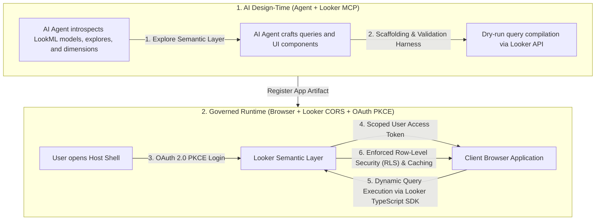
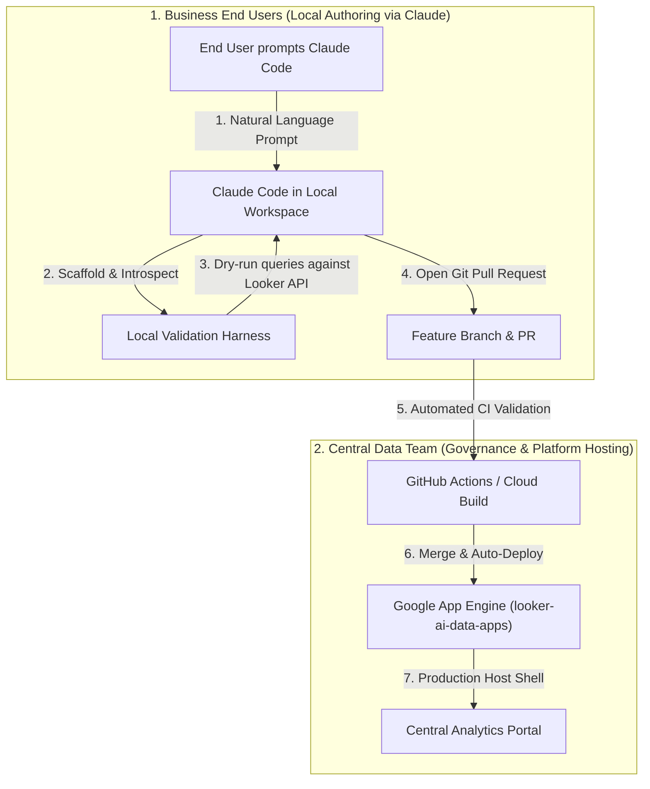

# Looker AI-Generated Governed Data Applications

This repository demonstrates an architecture where AI coding assistants (such as Claude Code) generate custom, high-performance web data applications backed dynamically by Looker's semantic layer via direct browser-to-Looker CORS API and OAuth 2.0 PKCE.


---

## Architecture Overview

Traditional LLM data workflows retrieve static data snapshots via MCP and embed hardcoded JSON data structures directly into generated React code.

### Limitations of Static LLM Dashboards

- **Stale Data**: Dashboards reflect a single point-in-time snapshot and do not update.
- **Broken Interactivity**: Date pickers, filters, and drill-downs either do not function or only filter static client-side slices.
- **Zero Governance**: Bypasses Looker user attributes, row-level security (RLS), access filters, and LookML caching.
- **Security Exposure**: If generated code is shared, all users see the data of the prompt author rather than their own governed view.

### Governed AI Data App Solution



1. **Design-Time (AI Agent + MCP)**: The AI agent uses Looker MCP tools (`get_dashboards`, `query`, `get_field_value_suggestions`) to explore the semantic layer and synthesize interactive React UI components.
2. **Declarative Query Binding**: Instead of hardcoding data, the AI generates declarative Looker query definitions (`model`, `view`, `fields`, `filters`, `sorts`) and hooks them to `useLookerQuery`.
3. **Automated Verification Harness**: Before any generated application is registered, CLI validators verify TypeScript types and dry-run query compilation against Looker's live API (`/api/4.0/queries/run/sql`).
4. **Runtime Governance**: When a user opens the application, they authenticate directly against Looker using **OAuth 2.0 with PKCE**. Looker returns short-lived access tokens, and all queries run against Looker's CORS API with the user's specific permissions and row-level access filters.

---

## Central Host Shell & Application Registry

The host platform functions as a lightweight runtime shell with zero in-app studio overhead:

- **Central App Registry (`src/apps/registry.ts`)**: Applications declare their ID, name, description, category, semantic model target, and default icon.
- **Header App Switcher**: Allows users to seamlessly switch between registered applications without page reloads.
- **URL Parameter Routing**: Direct deep-linking to specific applications via `/?app=<app-id>`.
- **Semantic Inspector**: An expandable diagnostics drawer displaying the live Looker query definitions, generated SQL, execution latency, and CORS response payloads.

### Included Out-of-the-Box Application

- **`basic-ecomm`** (E-Commerce Analytics): Revenue trends, order status breakdown, category performance, and item-level data grid using `basic_ecomm :: basic_order_items`.

---

## Semantic Model Requirements

### Default Sample Model: `basic_ecomm`

The default applications query the `basic_ecomm` model and `basic_order_items` explore:

- **Looker (Google Cloud core)**: Provisioned out-of-the-box in the default [Looker Core sample project](https://docs.cloud.google.com/looker/docs/looker-core-sample-project) (`sample_thelook_ecommerce`). If running on Looker Core, no additional LookML modeling is needed.
- **Standard Looker SaaS / Customer-Hosted**: Deploy the open-source repository [drstrangelooker/sample_thelook_ecommerce](https://github.com/drstrangelooker/sample_thelook_ecommerce) connected to Google's public BigQuery dataset (`bigquery-public-data.thelook_ecommerce`).

### Adapting to Custom Models

The platform is completely decoupled from any specific schema:

1. Update `model` and `view` in `src/apps/<app-name>/queries.ts` to match your LookML explore (e.g. `finance.transactions`).
2. Update the field dimension and measure references in `queries.ts` and the corresponding React app component.
3. Run the validation harness (`npm run validate:<app-name>`).

---

## Tech Stack

- **Framework**: React 18, TypeScript, Vite
- **Looker Integration**: Official `@looker/sdk` (Looker 4.0 API) and `@looker/sdk-rtl` (`OAuthSession`)
- **Styling**: Tailwind CSS, Lucide React
- **Data Visualizations**: Recharts (Area, Bar, Column, Donut, Line, Data Grids)
- **Runtime Polyfills**: `buffer` (enables browser compatibility for Looker SDK error decoders)
- **Dev Server**: Vite with `@vitejs/plugin-basic-ssl` (HTTPS required for browser Web Crypto PKCE)

---

## Quickstart

### 1. Register OAuth Clients in Looker (One-Time Admin Setup)

OAuth client applications are registered on the Looker instance by an administrator. This is a **one-time task owned by Looker Admins**, performed once per Looker instance. Application creators never perform these steps and never handle client secrets.

| Client                | Purpose                                        | Required?               |
| :-------------------- | :--------------------------------------------- | :---------------------- |
| Host Shell client (a) | Authenticates end users in the browser runtime | Always                  |
| CLI client (b)        | Authenticates the local validation harness     | Only without Looker MCP |
| Embed allowlist (c)   | Permits the Host Shell origin to embed Looker  | Always                  |

Register each client via the API Explorer
(`https://<your-instance>/extensions/marketplace_extension_api_explorer::api-explorer/4.0/methods/Auth/register_oauth_client_app`)
or by calling [`register_oauth_client_app`](https://cloud.google.com/looker/docs/reference/looker-api/latest/methods/Auth/register_oauth_client_app) directly.

#### a. Host Shell client (browser runtime) — required

Authenticates end users viewing deployed applications. Register one entry per origin you serve from (local development plus each deployed environment).

| Field          | Value                                                                            |
| :------------- | :------------------------------------------------------------------------------- |
| `client_guid`  | `looker-ai-data-apps`                                                            |
| `redirect_uri` | `https://localhost:3000/callback` (add a second client for your deployed origin) |
| `display_name` | Looker AI Data Apps                                                              |
| `enabled`      | `true`                                                                           |

#### b. CLI client (local validation tooling) — optional

> [!TIP]
> Skip this client if your creators author apps through an agent with a **Looker MCP** connection. The agent validates queries over its existing MCP session, so no local Looker credentials and no second OAuth client are involved. Register this client only if you need the standalone CLI path below.

Register it when either of these applies:

- Creators run `npm run validate:queries` outside an MCP-enabled agent.
- You want an interactive browser sign-in for the harness instead of issuing API keys.

CI pipelines do not need this client either; they authenticate with a service account (`LOOKER_CLIENT_ID` / `LOOKER_CLIENT_SECRET`) or an injected `LOOKER_ACCESS_TOKEN`.

```json
{
  "client_guid": "looker-ai-data-apps-cli",
  "redirect_uri": "http://localhost:8000/callback",
  "display_name": "Looker AI Data Apps CLI",
  "description": "Local semantic query validation for governed data apps",
  "enabled": true
}
```

> [!IMPORTANT]
> Looker enforces an **exact match** on `redirect_uri`, so the CLI loopback port cannot be randomized. Port `8000` is the default. If your users commonly have that port occupied, register additional clients on alternate ports (for example `8010`, `8020`) and have those users set `LOOKER_OAUTH_PORT` accordingly.

#### c. Embedded Domain Allowlist — required

Under **Admin > Embed**, add each Host Shell origin (for example `https://localhost:3000` and your deployed URL) to the allowlist.

### 2. Configure Environment

Copy `.env.example` to `.env`:

```bash
VITE_LOOKER_BASE_URL=https://<your-instance>.cloud.looker.com
VITE_LOOKER_CLIENT_ID=looker-ai-data-apps
VITE_LOOKER_REDIRECT_URI=https://localhost:3000/callback

# Optional: only needed for the standalone CLI validation harness.
# Agents validating through Looker MCP do not need these.
LOOKER_BASE_URL=https://<your-instance>.cloud.looker.com
LOOKER_OAUTH_CLIENT_ID=looker-ai-data-apps-cli
```

### 3. Run Development Server

```bash
npm install
npm run dev
```

Open `https://localhost:3000` in your browser. Accept the local self-signed development SSL certificate when prompted.

---

## Project Structure

```
src/
├── looker/
│   ├── config.ts              # Environment-aware Looker & OAuth configuration
│   ├── auth/
│   │   ├── session.ts         # Looker40SDK & PersistentOAuthSession initialization
│   │   ├── LookerAuthProvider.tsx # React Context for OAuth login/logout/user state
│   │   └── OAuthCallback.tsx  # PKCE authorization code exchange handler
│   └── hooks/
│       ├── useLookerSDK.ts    # Access authenticated Looker40SDK instance
│       ├── useLookerQuery.ts  # Reactive hook for sdk.run_inline_query
│       └── useFieldSuggestions.ts # Dynamic field value suggestions
├── components/
│   ├── layout/Header.tsx      # Navbar, App Switcher dropdown, auth badge, Inspector toggle
│   ├── common/
│   │   ├── MetricCard.tsx     # Single value KPI scorecard with formatting
│   │   ├── DataChart.tsx      # Recharts wrapper for Area, Bar, Donut, Line
│   │   ├── DataTable.tsx      # Governed data grid with sorting & CSV export
│   │   ├── FilterBar.tsx      # Interactive semantic filter controls
│   │   ├── SemanticInspector.tsx # Real-time Looker query & CORS inspector
│   │   └── LoginPrompt.tsx    # OAuth login screen
├── apps/
│   ├── registry.ts            # Central registry of all governed data applications
│   └── basic-ecomm/           # E-Commerce Analytics (basic_ecomm :: basic_order_items)
├── App.tsx                    # Dynamic app router (/?app=<id>) & shell layout
└── main.tsx                   # React DOM entrypoint with Buffer polyfill
scripts/
├── auth/                      # Looker OAuth 2.0 PKCE for local CLI tooling
│   ├── cli.ts                 # auth:login / auth:status / auth:logout commands
│   ├── config.ts              # Node-side config and shared dotenv loader
│   ├── crypto.ts              # Node Web Crypto implementation of ICryptoHash
│   ├── loopback.ts            # Loopback callback listener and browser launcher
│   ├── resolve.ts             # Credential precedence chain
│   ├── session.ts             # NodeOAuthSession extending the Looker SDK OAuthSession
│   └── token-store.ts         # Refresh token persistence (0600, keyed per instance)
├── validate-queries.ts        # Dry-runs queries against Looker API (POST /api/4.0/queries/run/sql)
├── validate-app.ts            # Verifies app contracts and executes tsc --noEmit
└── scaffold-app.ts            # Scaffolds boilerplate and auto-registers new apps
```

---

## How AI Agents Generate New Applications

AI assistants use `.agents/skills/generate-governed-app/SKILL.md` to autonomously generate, validate, and register new applications:

### 1. Scaffold Application

```bash
npm run scaffold:app -- --id <app-id> --name "<App Name>" --model <model> --view <explore> --category "<Category>"
```

This creates:

- `src/apps/<app-id>/queries.ts`
- `src/apps/<app-id>/<PascalCase>App.tsx`
- Registration entry in `src/apps/registry.ts`

### 2. Formulate LookML Queries & UI Layout

The AI agent introspects the semantic model using Looker MCP and constructs declarative queries, metric cards, charts, and data tables.

### 3. Run Validation Harness

Before registering or committing, the agent executes the validation harness:

```bash
# Dry-run queries against Looker API to verify dimensions, measures, and filters
npm run validate:queries <app-id>

# Verify application contracts and TypeScript compilation
npm run validate:app <app-id>

# Run all validators across the entire application suite
npm run validate
```

#### Authenticating the Validation Harness

`validate:app` is entirely local and needs no Looker credentials. Only `validate:queries` talks to Looker, and it resolves credentials in this order:

| Priority | Source                                      | Typical user                 |
| :------- | :------------------------------------------ | :--------------------------- |
| 1        | `--token <access_token>`                    | Ad-hoc debugging             |
| 2        | `LOOKER_ACCESS_TOKEN` env var               | CI pipelines                 |
| 3        | Stored OAuth refresh token                  | Returning creator, silent    |
| 4        | Interactive browser login                   | First-time creator, TTY only |
| 5        | `LOOKER_CLIENT_ID` + `LOOKER_CLIENT_SECRET` | Service accounts             |

> [!TIP]
> When an agent is working through **Looker MCP**, it validates queries directly over its existing MCP session and none of the above is required. The CLI credential chain matters for users running the harness outside an MCP-enabled agent, and for CI.

For a first-time creator, a single browser sign-in covers it:

```bash
npm run auth:login     # opens the browser, stores a refresh token
npm run auth:status    # shows the authenticated user and instance
npm run auth:logout    # revokes the session and deletes stored credentials
```

The refresh token is written to `~/.looker-ai-data-apps/credentials.json` with `0600` permissions and is keyed per instance, so switching between development and production Looker instances does not require re-authenticating each time. Subsequent validation runs refresh silently. No API keys or client secrets are ever issued to the creator.

In non-interactive shells (CI, or `CI=true`) the harness never attempts to open a browser; it fails fast with instructions to supply a token.

##### Signing In From a Remote Host

Looker redirects to `http://localhost:8000/callback`, which resolves on the machine running the browser. If you run `auth:login` over SSH or on a cloud workstation, forward the port before starting the login so that the redirect reaches the listener:

```bash
ssh -L 8000:localhost:8000 <remote-host>
npm run auth:login
```

`auth:login` always prints the authorization URL, so paste it into the browser on your local machine. Visiting `http://localhost:8000/` directly returns a "listener is running and waiting" message; that response confirms the tunnel is working, and it is not the sign-in page.

### 4. Load in Host Shell

Once validated, the application is immediately accessible from the Header App Switcher dropdown or via direct URL:

```
https://localhost:3000/?app=<app-id>
```

---

## Self-Serve Operating & Deployment Model

This architecture implements a decentralized creator model backed by centralized governance:



### Separation of Responsibilities

- **Central Data Team (Platform Owners)**:
  - Owns and manages the LookML semantic layer, row-level security (RLS), and Looker instance configuration.
  - Owns and operates the deployed Host Shell infrastructure on Google App Engine.
  - Configures automated CI/CD pipelines to validate incoming Pull Requests and deploy merged applications.
  - Avoids becoming a bottleneck for one-off reporting dashboard requests.

- **Business End Users (Application Creators)**:
  - Use Claude Code in a local workspace to self-serve new analytics applications on demand.
  - Claude runs scaffolding (`npm run scaffold:app`) and verification (`npm run validate`) locally in the background.
  - Once validated, Claude commits to a feature branch and opens a Pull Request (`gh pr create`).
  - Users require zero Google Cloud IAM permissions and never execute deployment commands directly.

### Enterprise Delivery Pipeline

1. **Local Authoring & Validation**: The business user clones the repository (or an internal starter template) and prompts Claude Code. Claude drafts declarative queries and UI components, verifying every field and query against Looker's live API using the validation harness.
2. **Automated CI Validation**: When Claude opens a Pull Request, the central CI workflow automatically runs `npm run validate` against Looker. Pull Requests containing hallucinated dimensions, broken measures, or invalid TypeScript types are blocked automatically.
3. **Continuous Deployment**: When the Central Data Team approves or auto-merges the Pull Request to `main`, the CI pipeline executes `npm run deploy:gae` to update the production App Engine service without downtime.

---

## Deployment to Google App Engine

The repository includes Google App Engine Standard configuration (`app.yaml`) optimized for static CDN edge caching and zero cold starts.

### Dedicated Service Isolation (`app.yaml`)

To avoid overwriting existing App Engine applications within the same Google Cloud project, deployment is configured to a dedicated service:

- **Service Name**: `looker-ai-data-apps`
- **Runtime**: `nodejs22`
- **Routing**: Static handlers serve hashed assets directly from Google edge infrastructure with an SPA fallback rule (`/.* -> dist/index.html`).

### Production Looker Prerequisites

1. **OAuth Client Registration**:
   Register an OAuth client application in Looker matching the deployed App Engine domain:
   - **Client ID**: `looker-ai-data-apps`
   - **Redirect URI**: `https://<service>-dot-<PROJECT_ID>.<REGION>.r.appspot.com/callback`

2. **Embedded Domain Allowlist**:
   Add the App Engine origin to Looker's **Embedded Domain Allowlist** (Admin > Embed):
   - `https://<service>-dot-<PROJECT_ID>.<REGION>.r.appspot.com`
   - `https://<service>-dot-<PROJECT_ID>.appspot.com`

### Build and Deploy Commands

```bash
# Build production bundle
npm run build

# Deploy to Google App Engine
gcloud app deploy app.yaml --project=<PROJECT_ID>
```

The application will be available at:
`https://looker-ai-data-apps-dot-<PROJECT_ID>.<REGION>.r.appspot.com`
