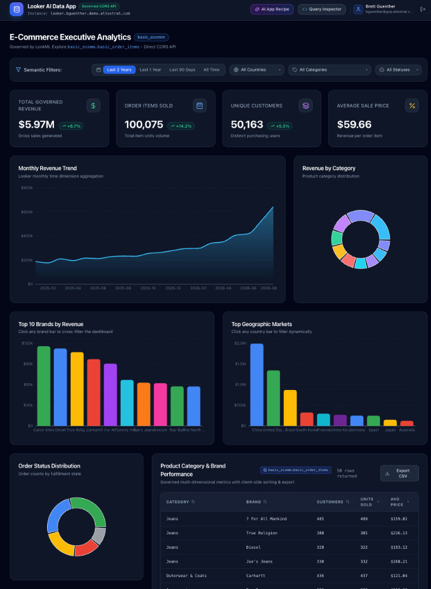

# Looker AI-Generated Governed Data Applications

This repository demonstrates an end-to-end architecture where **AI pair programmers / LLMs create custom, high-performance data applications** backed dynamically by **Looker's semantic layer** via **direct browser-to-Looker CORS API** and **OAuth 2.0 PKCE**.



---

## 🎯 The Problem This Solves

Traditional LLM data workflows (like Claude Artifacts or one-off code generation) retrieve static data snapshots via MCP and embed hardcoded JSON arrays directly into generated React code.

### Limitations of Static LLM Dashboards:
* ❌ **Stale Data**: Dashboards are dead on arrival and never update.
* ❌ **Broken Interactivity**: Date pickers, filters, and drill-downs either don't work or only filter client-side static slices.
* ❌ **Zero Governance**: Bypasses Looker user attributes, row-level security (RLS), access filters, and LookML caching.
* ❌ **Security Risk**: If generated code is shared, all users see the data of the prompt author rather than their own governed view.

---

## 🚀 The Governed AI Data App Solution

```
┌─────────────────────────────────────────────────────────────┐
│ 1. AI Design-Time (LLM + Looker MCP)                        │
│    • LLM introspects LookML models, explores, & dimensions  │
│    • LLM outputs React components with Looker query hooks   │
└──────────────────────────────┬──────────────────────────────┘
                               │
                               ▼
┌─────────────────────────────────────────────────────────────┐
│ 2. Governed Runtime (Browser + Looker CORS + OAuth PKCE)    │
│    • User logs in via Looker OAuth 2.0 PKCE                 │
│    • App executes dynamic queries via Looker TypeScript SDK │
│    • Looker enforces Row-Level Security (RLS) & Governance  │
└─────────────────────────────────────────────────────────────┘
```

1. **Design-Time (AI Agent + MCP)**: The AI agent uses Looker MCP tools (`get_dashboards`, `query`, `get_field_value_suggestions`) to explore the semantic layer and synthesize interactive React UI components.
2. **Declarative Query Binding**: Instead of hardcoding data, the AI generates declarative Looker query definitions (`model`, `view`, `fields`, `filters`, `sorts`) and hooks them to `useLookerQuery`.
3. **Runtime Governance**: When a user opens the application, they authenticate directly against Looker using **OAuth 2.0 with PKCE**. Looker returns short-lived access tokens, and all queries run against Looker's CORS API with the user's specific permissions and row-level access filters.

---

## 📊 Semantic Model Requirements & Deployments

### Default Sample App: `basic_ecomm`
The default out-of-the-box demo app is configured to query the **`basic_ecomm`** model and **`basic_order_items`** explore.

* **Looker (Google Cloud core)**: This model is provisioned out-of-the-box in the default [Looker Core sample project](https://docs.cloud.google.com/looker/docs/looker-core-sample-project) (`sample_thelook_ecommerce`). If you are running on a Looker (Google Cloud core) instance, no additional LookML setup is required.

### Alternatives for Non-Looker Core Deployments:

If your instance does not have the `basic_ecomm` sample model (e.g. standard Looker SaaS or customer-hosted instances), you can use any of the following approaches:

1. **Adapt to Any Custom LookML Model**:
   * The architecture is completely decoupled from the data model.
   * Edit `src/apps/<app-name>/queries.ts` to replace `model: 'basic_ecomm'` and `view: 'basic_order_items'` with your own LookML model and explore (e.g. `finance.transactions`, `marketing.campaign_performance`, `sales.opportunities`).
   * Update the field dimension and measure references in `queries.ts` and `BasicEcommApp.tsx`.

2. **Deploy the Open-Source `sample_thelook_ecommerce` LookML Model**:
   * For standard or customer-hosted Looker instances, you can clone the open-source repository [drstrangelooker/sample_thelook_ecommerce](https://github.com/drstrangelooker/sample_thelook_ecommerce) into your Looker instance connected to Google's public BigQuery dataset (`bigquery-public-data.thelook_ecommerce`). This provides the exact same `basic_ecomm` model and `basic_order_items` explore used by this demo app.

3. **AI-Generated Custom Applications for Your Data Domain**:
   * Have your AI pair programmer explore your instance's semantic layer via Looker MCP and scaffold a brand new customized data application in seconds (see below).

---

## 🛠️ Tech Stack

* **Framework**: React 18, TypeScript, Vite
* **Looker Integration**: Official `@looker/sdk` (Looker 4.0 API) & `@looker/sdk-rtl` (`OAuthSession`)
* **Styling**: Tailwind CSS & Lucide React
* **Data Visualizations**: Recharts (Area, Bar, Column, Donut, Tables)
* **Dev Server**: Vite with `@vitejs/plugin-basic-ssl` (HTTPS required for browser Web Crypto PKCE)

---

## ⚡ Quickstart

### 1. Configure OAuth in Looker

Ensure an OAuth client app is registered in your Looker instance (Admin > Platform > API Explorer or Admin UI):
* **Client ID (`client_guid`)**: `looker-oauth-app`
* **Redirect URI**: `https://localhost:3000/callback`
* **Embedded Domain Allowlist** (Admin > Embed): Ensure `https://localhost:3000` is present.

### 2. Environment Configuration

Check `.env` (copy from `.env.example`):
```bash
VITE_LOOKER_BASE_URL=https://your-company.looker.com
VITE_LOOKER_CLIENT_ID=looker-oauth-app
VITE_LOOKER_REDIRECT_URI=https://localhost:3000/callback
```

### 3. Run Development Server

```bash
npm run dev
```

Open your browser to:
**`https://localhost:3000`**

*(Note: Because the dev server uses a local self-signed SSL certificate for HTTPS, accept the browser certificate warning on first load).*

---

## 📂 Project Structure

```
src/
├── looker/
│   ├── config.ts              # Looker instance & OAuth client configuration
│   ├── auth/
│   │   ├── session.ts         # Looker40SDK & PersistentOAuthSession initialization
│   │   ├── LookerAuthProvider.tsx # React Context for OAuth login/logout/user state
│   │   └── OAuthCallback.tsx  # PKCE authorization code exchange handler
│   └── hooks/
│       ├── useLookerSDK.ts    # Access authenticated Looker40SDK instance
│       ├── useLookerQuery.ts  # Reactive hook for sdk.run_inline_query
│       └── useFieldSuggestions.ts # Dynamic field value suggestions
├── components/
│   ├── layout/Header.tsx      # Navbar, auth badge, Query Inspector toggle
│   ├── common/
│   │   ├── MetricCard.tsx     # Single value KPI scorecard with formatting
│   │   ├── DataChart.tsx      # Recharts wrapper for Area, Bar, Donut, Line
│   │   ├── DataTable.tsx      # Governed data grid with sorting & CSV export
│   │   ├── FilterBar.tsx      # Interactive semantic filter controls
│   │   ├── SemanticInspector.tsx # Real-time Looker query & CORS inspector
│   │   └── LoginPrompt.tsx    # OAuth login screen
├── apps/
│   ├── basic-ecomm/           # AI-Generated E-Commerce App (basic_ecomm)
│   │   ├── queries.ts         # Declarative Looker query definitions
│   │   └── BasicEcommApp.tsx  # Interactive dashboard component
│   └── app-generator/         # AI Generation Recipe & prompt modal
├── App.tsx                    # Root routing & layout
└── main.tsx                   # React DOM entrypoint
```

---

## 🤖 How AI Agents Generate New Applications

To have an AI assistant generate a new data application:

```prompt
I want to create a new Looker AI Data App for the "<model_name>" model.
Please:
1. Use Looker MCP to explore the models, explores, and dimensions/measures.
2. Formulate declarative Looker query definitions in a queries.ts file.
3. Build an interactive React component using the useLookerQuery hook with dynamic filters, KPIs, charts, and table.
4. Integrate the new app into the LookerAuthProvider harness.
```
